Cinema Management System - DBMS Project

Problem Statement

The Cinema Management System is designed to manage the operations of a cinema, focusing on movie scheduling, customer bookings, and transaction management. This database facilitates the storage, retrieval, and management of essential data such as movie details, showtimes, customer bookings, and payment transactions. The system supports various operations like adding new movies, updating show schedules, managing customer records, and handling ticket sales.

Conceptual Diagram

it will show all relation ship used in our projec 
==============================================================

Movies Table 
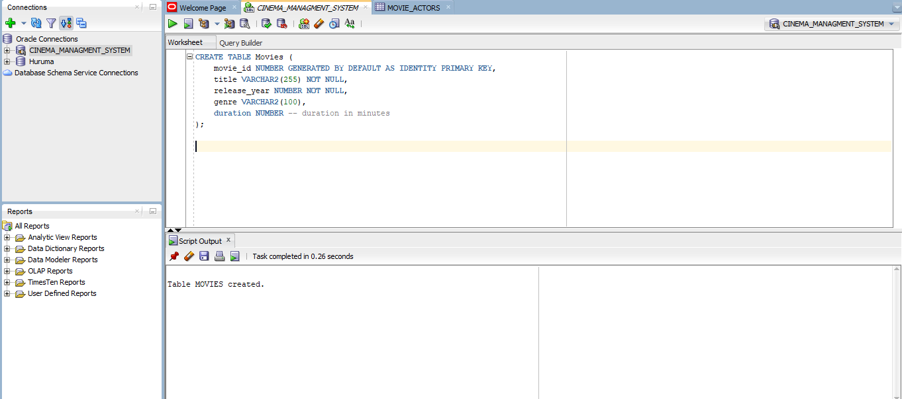

this is the table of movies  it shows all query

===========================================================

Movie Actor

the table of moviee actor

 ========================================================

Actors
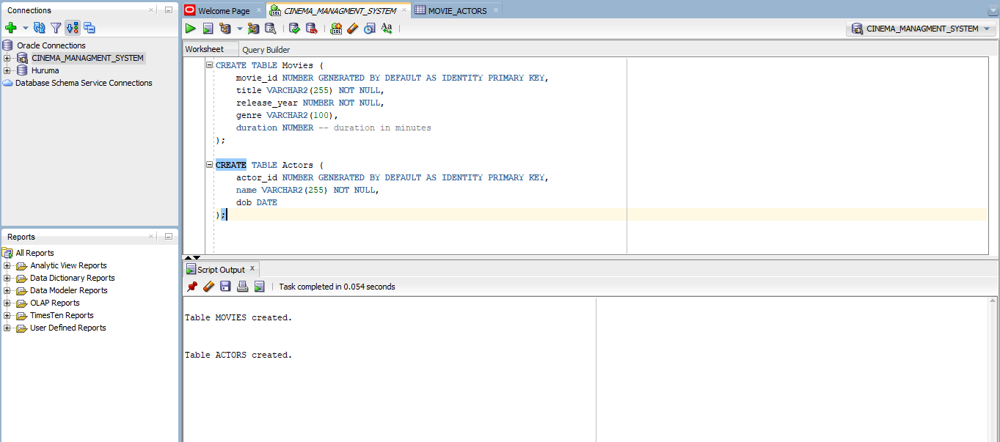

the the of that show all actors
========================================================

Tickets
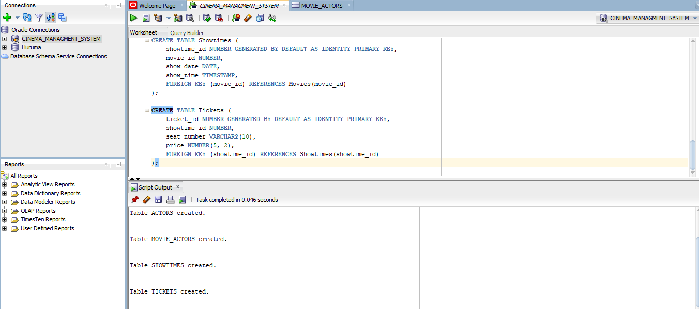

the table that show all tickets that are booked

===========================================================

Time
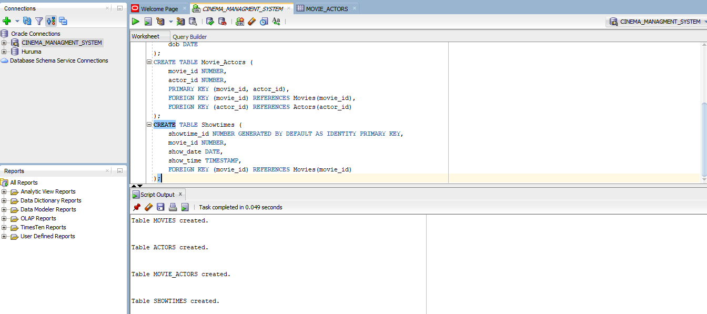

the table of time  that show the time of movies will start and the end of movies

===================================================================================

Rows OF ALL THE TABLES
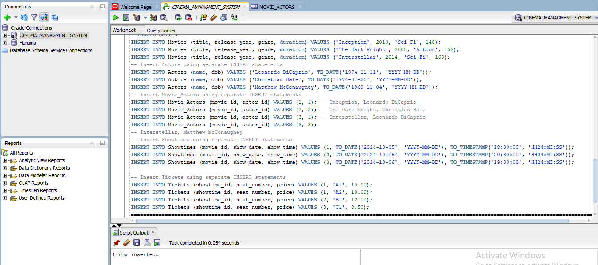

this is the all rows of all the table  we create  for the above table

ROW MOVIES
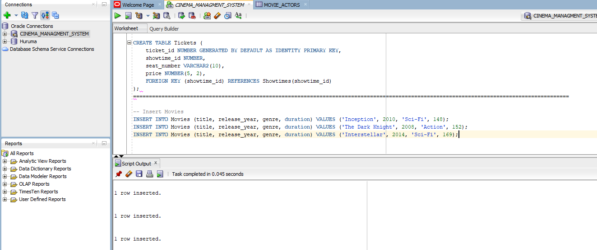

=======================================================================================

UPDATE
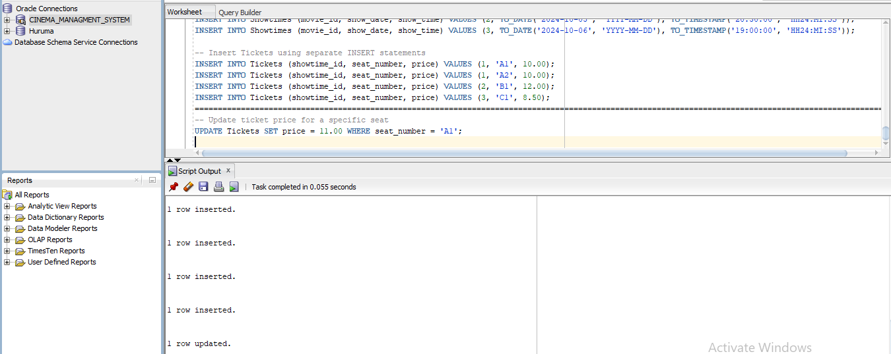

this about the up date all data  in the table we have

=========================================================================================

DELETE
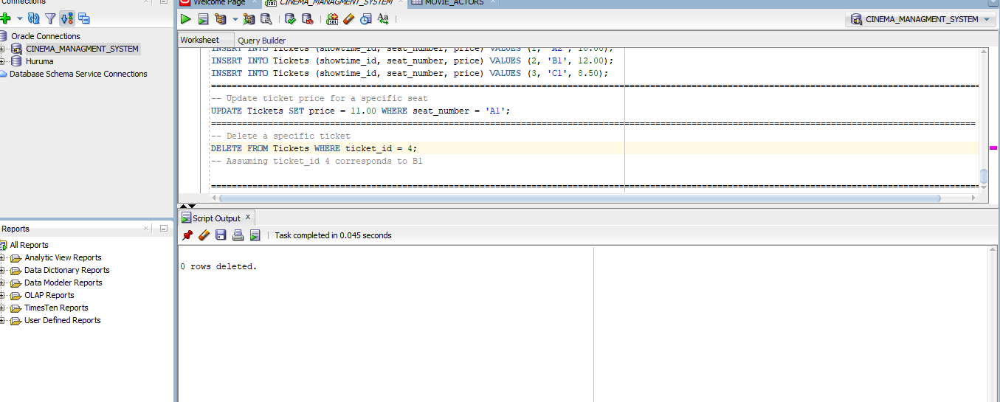

this about the delete 

================================================================================
Join
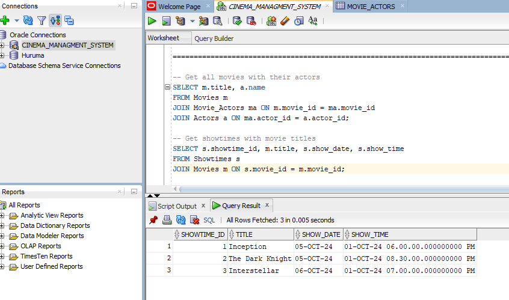

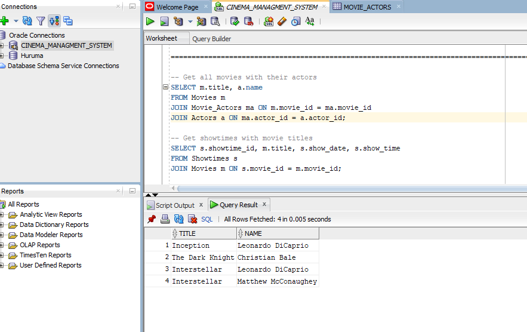

its about join of table

========================================================================================

SUBQUERRY
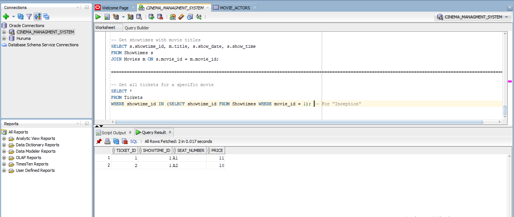

Above are all the results from sql developer`
