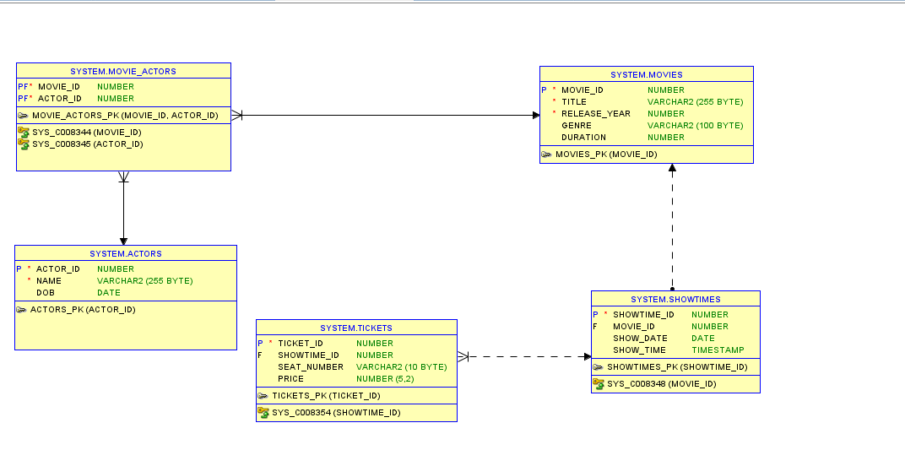
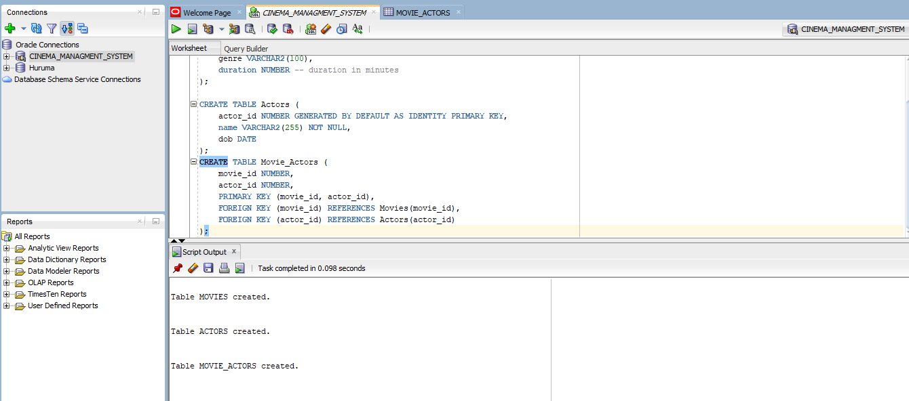

Cinema Management System - DBMS Project

Problem Statement

The Cinema Management System is designed to manage the operations of a cinema, focusing on movie scheduling, customer bookings, and transaction management. This database facilitates the storage, retrieval, and management of essential data such as movie details, showtimes, customer bookings, and payment transactions. The system supports various operations like adding new movies, updating show schedules, managing customer records, and handling ticket sales.

Conceptual Diagram

Movies Table 

Movie Actor

Actors

Tickets

Time

Rows OF ALL THE TABLES

ROW MOVIES

UPDATE

DELETE

Join

SUBQUERRY

Above are all the results from sql developer`
